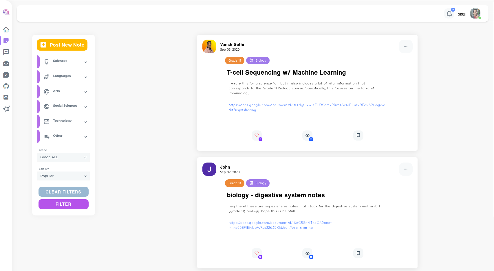
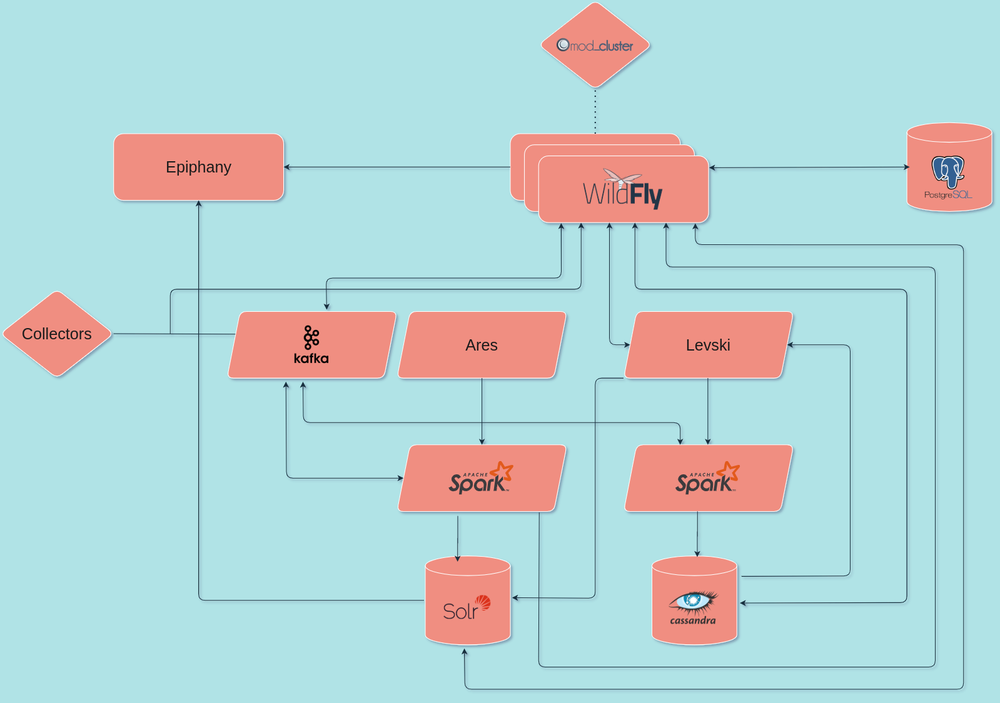

High schoolers often have trouble finding a career path and even more so, a method of finding their career path. They search for a job that they like and fits their personal and their family's needs. And you can find it too.

Whether it be co-ops, internships, mentors, research or introspection, there are many ways of narrowing your career choices, but what are the most important values and methods to consider on the quest for your lifelong career path?

I'll show you (if you're considering software development).

But why should you trust some university software developer about career paths?

Because I mentor 3 high school robotics teams and 2 high school startups. You can check out [Quento](https://quento.ca), whose tools help streamline studying for high school students.
You can also check out [EdgePrim](https://edgeprim.com/) who creates custom software for small businesses.
I also recently helped deliver an MVP (more on what that means later) to customers at Ericsson.

## My story

In Grade 11, I wasn't quite sure what I wanted to be. I was mainly deciding between software or radiology. They seemed to both be cool fields, so to figure out how one of them was like, I registered into my high school's co-op program.

Luckily two of my friends recommended me to a telecommunications service assurance company with over 100 employees at the time. As someone with not a lot of programming experience, learning Python and passing the interview in two weeks while studying and writing exams was *quite* the experience.

Before my term started, my supervisor, Jonathan Crone, drew and explained the general architecture of the product. Other than the skills and interest gained from working, that diagram was the most influential on my was the most influential on my development and growth. More on that later.

When explaining the architecture, I had no clue what he was saying. All I heard were various names, mostly from various mythologies:

Cassandra, Ares, Hecate, Hyperion, Heimdallr, Levski, Forseti, Helios, Cthulu... Greedo, from Star Wars? Postgres, mod_cluster, Spark, NiFi, ZooKeeper, Solr, Kafka, WildFly, Epiphany, Delorean... Isn't Delorean a car manufacturer? Yeah... I had no clue what was going on...

During the term, I didn't bother trying to figure out the meanings and functions behind those names, since I first had to figure out how to complete my tasks (more formally known as stories).

It was essentially a constant struggle for the whole 2 months of the term. Turns out that challenges are super fun for me. 

By the end of the term, I had learned Python, pandas, NumPy, matplotlib, Solr querying and ssh but more importantly, I learnt:
* what it's like to work at a real software company and
* that I'd like to continue making software solutions for the rest of my career.

## Architecture diagram

After my term ended, I still had no clue what the names in the architecture diagram meant, so I decided to look some of them up.

I started with Cassandra and that led me down an Apache rabbit hole, which led me to learning about Kafka, Hadoop, MapReduce, ZooKeeper, NiFi, Solr, Spark, Avro, Pig and HBase.

That led me to figuring out that a lot of these technologies were based on technologies from Google, Amazon etc. For example, HDFS (Hadoop Distributed File System) was adapted from the GFS (Google File System) white paper.

I ended up figuring out that some of those fancy names, like Ares and Hecate were proprietary to the company, although a lot of them were open source technologies.

So what factors led to me locking in my career choice?

1. Early mentorship
2. Real work experience

## Early mentorship

On the job, I was constantly challenged, but how was I able to complete the stories assigned to me?

Jonathan, my mentor and supervisor  had a huge backlog of stories to complete, so there were lots of things he could assign to me. 

As a woodworking teacher, a senior engineer and a history of mentoring co-ops, he knew how to tailor the co-op experience to individuals of varying backgrounds.

Starting relatively easy, these stories became increasingly difficult in complexity, but for me it felt as though there was a constant challenge, since I was learning when completing stories.

Not only did he assign me stories that weren't too easy or too difficult, but he also explained the architecture of the product that started to make and more sense every month (especially after the co-op term ended).

That sense of mystery led to me exploring further, improving my architectural knowledge and getting deeper into the field.

That's a pretty good indicator that someone loves what they're doing. If I hadn't liked it, my quest of a full understanding wouldn't be there.

Initial direction from a mentor is very useful for setting students up for self-direction later on. A good mentor will also make sure that you're always learning and never experiencing boredom.

## Real work experience

Many high schoolers love programming and do a lot of it, but the lack of real work experience shows.

Their code is generally not production-ready: insecure (Check out [OWASP Top 10 Security Risks](https://owasp.org/www-project-top-ten/) for some examples), not regulatory compliant ([GDPR](https://gdpr.eu/), [PIPEDA](https://www.priv.gc.ca/en/privacy-topics/privacy-laws-in-canada/the-personal-information-protection-and-electronic-documents-act-pipeda/)), resistant to changing requirements and not designed in a way that can easily scale.

But that's okay.

High schoolers usually don't need to deal with scaling or lots of users where these pop up, but it doesn't mean that it's ideal.

In the product development world, there is a term thrown around called MVP and it's not most valuable player.

**Minimum viable product (MVP)** refers to a version of a product with a minimal set of features, but just enough to satisfy early customers.

Let's look at a part of [Discord](https://discord.com/)'s company culture:

> Build quickly to prove out a product feature, but always with a path to a more robust solution.
>
> Source: [How Discord Stores Billions of Messages](https://blog.discord.com/how-discord-stores-billions-of-messages-7fa6ec7ee4c7)

Although this is a bit of an oversimplification, they essentially built an MVP with MongoDB and had plans for switching out (to Cassandra) when performance and stability issues popped up.

What I'm seeing is that high schoolers are missing the action plan if their product becomes successful.

In my opinion, just having exposure to people caring about security, performance and stability is enough to make students learn and be aware of them in their own work.

I'll give my example. 

Although GDPR was on the news quite a lot with lawsuits against Facebook, Google and others, I didn't really pay much attention to what it was.

It was when I worked in a company that cared about GDPR-compliance that I realized what it was and its importance. The same applies to the other points I mentioned.

Although this article is very software-focused, real work experience provides hands-on, practical knowledge no matter what field.

## How to get real work experience in high school

Finding a job is very hard, especially as a high school student.

There are companies that have job postings for high school co-op/interns, although few, so you'll likely need some alternatives.

The best way, as with any job, is to reach out to your connections, whether they be parents, family friends or parents of friends.
They can find ways to get you into the company and potentially directly be your supervisor.

Additionally, I'd recommend looking at other high schoolers around the city to see if anyone has already found co-ops/internships.
If you can find one, you should try reaching out and seeing if you can get a similar opportunity.

If those people don't exist, the search will be much harder.

You will likely need to research companies and cold email/message employees at local companies. Often startups will take high school co-ops, but may be harder to find.

Unfortunately, cold emails don't have high response rates, but all you need is one positive reply and you're good.

Hopefully, this helps get you an early start or find your career path.
