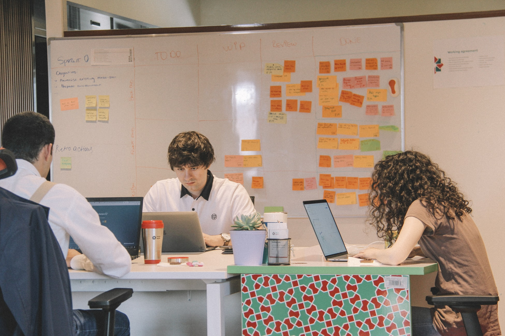

High schoolers often have trouble finding a career path. They search for a job that they like and fits their personal and their family's needs. And you can find it too.

What are the most important methods to locking in your lifelong career path?

I'll show you (if you're considering software development).

But why should you trust some university software developer about career paths?

Because I mentor 3 high school robotics teams and 2 high school startups. Check out [Quento](https://quento.ca), whose tools help streamline studying for high school students.
You can also check out [EdgePrim](https://edgeprim.com/) who creates custom software for small businesses.
I also recently helped deliver an MVP (more on what that means later) to customers at Ericsson.

## My story

In Grade 11, I wasn't quite sure what I wanted to be. I was deciding between software or radiology. Both seemed  cool, so to figure out how one of them was like, I registered into my high school's co-op program.

Luckily, two of my friends recommended me to a telecom company with over 100 employees. Learning Python and passing the interview in two weeks while studying and writing exams was *quite* the experience.

My supervisor, Jonathan Crone, drew and explained the architecture of the product. That diagram was the most influential on my development and growth. More on that later.

When explaining the architecture, I had no clue what he was saying. All I heard were various names, mostly from various mythologies:

Cassandra, Ares, Hecate, Hyperion, Heimdallr, Levski, Forseti, Helios, Cthulu... Greedo, from Star Wars? Postgres, mod_cluster, Spark, NiFi, ZooKeeper, Solr, Kafka, WildFly, Epiphany, Delorean... Isn't Delorean a car manufacturer? Yeah... I had no clue what was going on...

Figuring out the meanings behind those names was my last priority during the term. First, I had to figure out how to complete my tasks (called stories).

It was a constant struggle for the whole 2 months of the term. Turns out that challenges are super fun for me.

By the end of the term, I had learned Python, pandas, NumPy, matplotlib, Solr querying and ssh. More importantly, I learnt:
* what it's like to work at a real software company and
* that I'd like to continue making software solutions for the rest of my career.

## Architecture diagram

After my term ended, I still had no clue what the names in the architecture diagram meant.

So I decided to look some of them up.

I started with Cassandra and that led me down an Apache rabbit hole: Kafka, Hadoop, MapReduce, ZooKeeper, NiFi, Solr, Spark, Avro, Pig and HBase to name a few.

That led me to figuring out some cool facts. For example, Google File System's (GFS) whitepaper inspired Hadoop Distributed File System (HDFS).

I ended up figuring out that some of those fancy names, like Ares and Hecate were proprietary to the company. Although, a lot of them were open source technologies.

So what factors led to me locking in my career choice?

1. Early mentorship
2. Real work experience

## Early mentorship

On the job, I was constantly challenged, but how was I able to complete the stories assigned to me?

Jonathan, my mentor and supervisor had a huge backlog of stories to complete, so there were lots of things he could assign to me.

He was a woodworking teacher, a senior engineer and had a history of mentoring co-ops. As a result, he knew how to tailor the co-op experience to individuals of varying backgrounds.

Starting at my skill level, these stories became increasingly difficult in complexity. For me it felt as though there was a constant challenge, since I was learning when completing stories.

He assigned me stories that weren't too easy or too difficult.

He also explained the architecture of the product. My lack of understanding in that area led to me exploring further. That's what got me "hooked" on software.

That's a pretty good indicator that someone loves what they're doing. If I hadn't liked it, my quest of a full understanding wouldn't be there.

Having a mentor early on can set you on the right path. From there you can become independent and find your own path.

## Real work experience

Many high schoolers love programming and do a lot of it, but the lack of real work experience shows.

Their code is generally not production-ready. By this, I mean that you can find [OWASP Top 10 Security Risks](https://owasp.org/www-project-top-ten/) in it. Their apps are not regulatory compliant ([GDPR](https://gdpr.eu/), [PIPEDA](https://www.priv.gc.ca/en/privacy-topics/privacy-laws-in-canada/the-personal-information-protection-and-electronic-documents-act-pipeda/)). It's written in a way that's resistant to changing requirements (especially scaling).

But that's okay.

High schoolers usually don't need to deal with scaling or lots of users where these pop up. That doesn't mean it's ideal though.

**Minimum viable product (MVP)** refers to a version of a product with a minimal set of features, but just enough to satisfy early customers.

Let's look at a part of [Discord](https://discord.com/)'s company culture:

> Build quickly to prove out a product feature, but always with a path to a more robust solution.
>
> Source: [How Discord Stores Billions of Messages](https://blog.discord.com/how-discord-stores-billions-of-messages-7fa6ec7ee4c7)

They built an MVP with MongoDB and had plans for switching out (to Cassandra) when performance and stability issues popped up.

High schoolers are missing the action plan if their product becomes successful.

Developers can find ways to develop this skill through exposure.

I'll give my example.

Although GDPR lawsuits against Facebook, Google and others were on the news, I didn't pay much attention to what it was all about.

It was when I worked in a company that cared about GDPR-compliance that I realized its importance. The same applies to the other points I mentioned.

Real work experience provides hands-on, practical knowledge no matter what field.

## How to get real work experience in high school

Finding a job is very hard, especially as a high school student.

There are companies that have job postings for high school co-op/interns. You'll likely need some alternatives, since there aren't many.

Reach out to your connections. They can be parents, family friends or even parents of friends . They can find ways to get you into the company and potentially act as your supervisor.

Additionally, I'd recommend looking at other high schoolers around the city to see if anyone has already found co-ops. If you can find one, you should try reaching out and seeing if you can get a similar opportunity.

If those people don't exist, the search will be much harder.

You will likely need to research for companies in your area. Often startups will take high school co-ops, but may be harder to find. You'll need to cold email/message employees at these companies. 

Unfortunately, cold emails don't have high response rates. Don't lose hope though. All you need is one positive reply and you're good.

Hopefully this helps get you an early start or help you find your career path.
