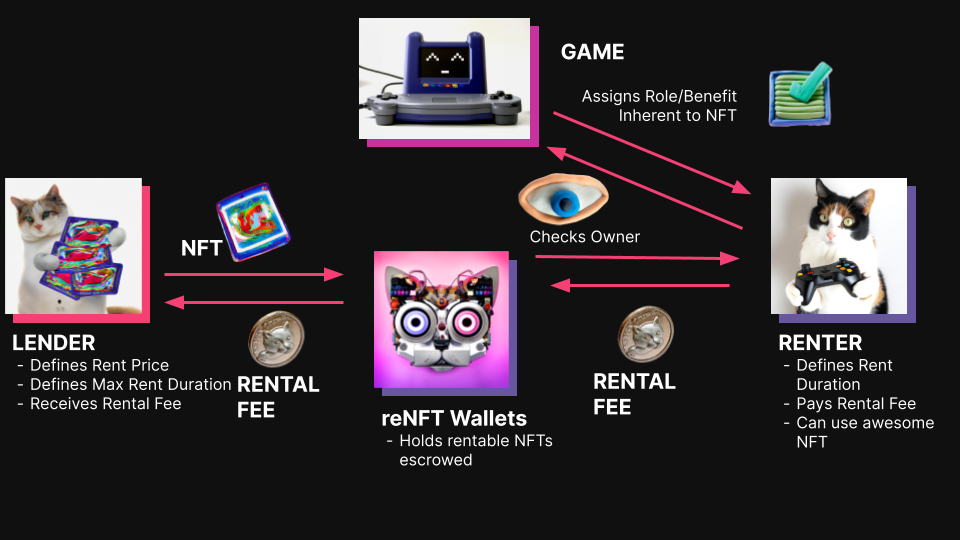
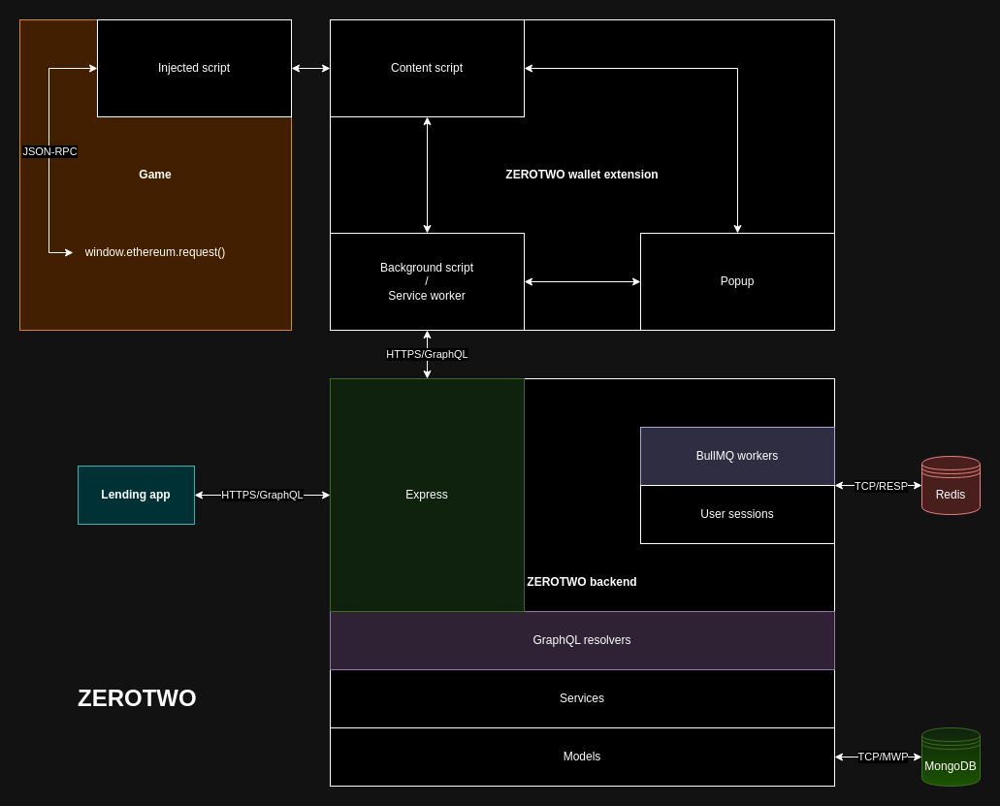
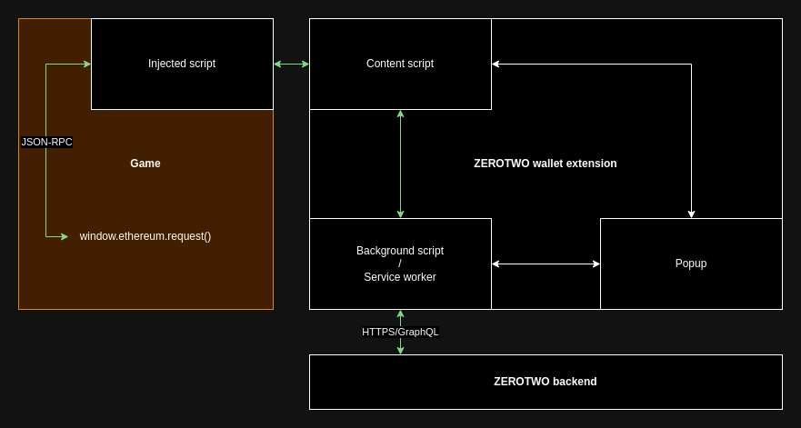
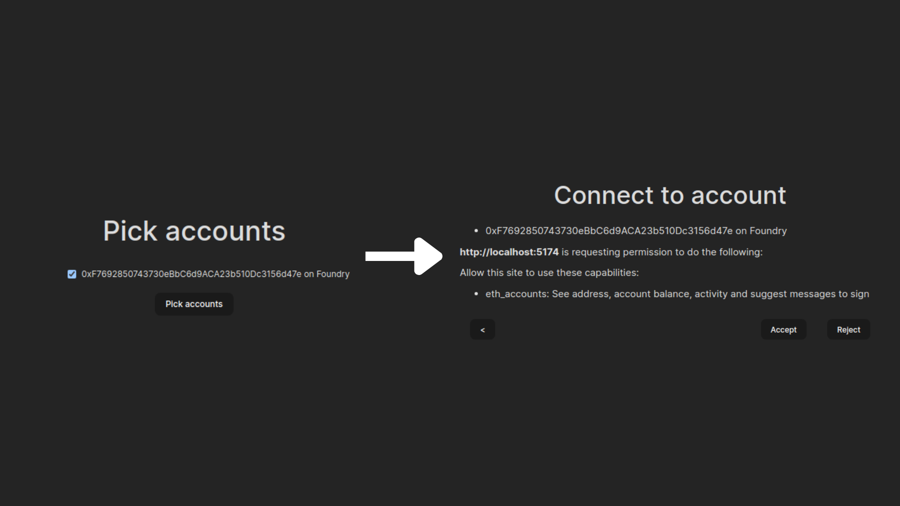
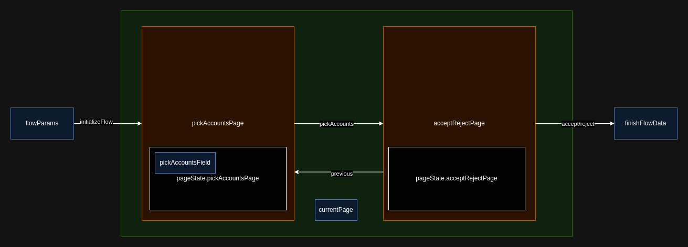

Asset rentals on blockchains need to change for mass adoption. They need to be zero-integration and collateral-free. Here's why:

First, some background. [reNFT](https://www.renft.io/) allows users to lend and rent assets/NFTs across multiple blockchains (they have 100k+ rentals on their platform). Their main focus is on the gaming industry where rented assets can include in-game items and characters. Most games have free-to-play models or one-time costs in the tens of dollars, which result in relatively low barriers to entry. Conversely, Web3 games sometimes require assets worth thousands of dollars to play, which makes trying them out financially difficult to justify. By renting assets for these games instead of buying them, the cost of exploring a game is significantly reduced by multiple orders of magnitude.

[reNFT's V2 solution](https://docs.renft.io/rental-solutions/collateral-free) solves this problem by holding an asset in an escrow account when it's being rented, and asking games to call a [reNFT API](https://docs.renft.io/developers/querying-renfts-on-chain-data) hosted on [The Graph](https://thegraph.com/) to check if that asset is being rented by the gamer. Not all games will take the effort to call this API and even if they do, it would add another task for them to do when they already have enough on their plate. The act of calling our API and requiring games to take some effort to support us is what we call "integration", and is one of the core problems of V2.

## Pseudo-ownership

reNFT's upcoming V3 solution and ZEROTWO aim to solve this by having renters have pseudo-ownership over an asset while it's being rented. [reNFT's V1 collateralized solution](https://docs.renft.io/rental-solutions/collateralized) allowed renters to take full ownership of the asset during a rental. Renters sent money, called collateral, to an escrow account for the duration of the rental. They would get it back once the rental and the asset is returned. The amount of money sent was usually equivalent in value to the price of the asset. If the renter does not return the asset, the collateral is given to the lender as compensation. Generally, lenders were incentivized to only allow shorter-term rentals, since prices could fluctuate up, causing renters to be financially motivated to not return the asset. This solution has 2 main problems:

1. There is a risk of lenders not getting back their asset. Even with collateral, many would consider losing an asset non-ideal (especially if the asset goes up in value).
2. Renters need to have large amounts of money to rent , even though they will generally get it back. This significantly increases the barrier to entry for these games.

An ideal solution would require renters to "own" an asset for the duration of a rental, paying only the rental price without collateral, while ensuring lenders can get their asset back when a rental is complete. We narrowed possible solutions to: a custodial solution (ZEROTWO) and a non-custodial solution (V3)

## Introduction to ZEROTWO



**Zero Effort Rentals & Off-Chain Transactional Wallet Operations** or **ZEROTWO** is a system that manages wallets (key pairs) and allows limited use of these wallets through backend business logic. Renters "own" these wallets, but they're managed by ZEROTWO. By restricting how a renter can interact with their managed wallet, the backend can allow users to prove ownership of a wallet in a game and therefore, the asset in it during a rental. Since ZEROTWO manages the wallet, it is the only one who can transfer assets to and from the managed renter wallet, and it will only do that at the start and end of a rental. The renter cannot transfer an asset to other wallets against the wishes of lenders becase ZEROTWO does not expose a way to do that.



In the above diagram, the game is a website that supports EVM chains, and connects to a wallet extension to see if a gamer owns an asset in-game. The ZEROTWO wallet extension acts like any other wallet extension like MetaMask or Frame, but renters can only sign messages and connect the managed wallet to the website. For games that are not a website, the extension can be replaced with [WalletConnect](https://walletconnect.com/), which would be implemented by the ZEROTWO backend directly.

The wallet extension's main purpose is to allow renters to prove to a game that they own an asset in their managed wallet. The lending app is very similar to the existing [reNFT marketplace](https://market.renft.io/), which allows users to lend and rent assets. The ZEROTWO backend is the brains of the operation and manages key pairs, gets rental data, manages users' lender orders and renter orders, manages wallet permissions, signs data to prove ownership, and much more. Lender orders manage the state of an asset lending, and renter orders manage the state of asset rentals. The "orders" terminology was inspired from marketplaces like [OpenSea](https://opensea.io/).

The rest of the article will be focused on a select number of ZEROTWO's technical challenges and their solutions.

## Multi-chain

Users prefer to own their own keys, so a non-custodial product will generally be preferred over a custodial product. So, in what scenarios is ZEROTWO advantageous?

One of the goals of ZEROTWO is to have the ability to iterate quickly, which is accomplished by implementing business logic in the backend rather than in smart contracts. The lack of smart contract lock-in means backend business logic can be written in a chain-agnostic way. To achieve this, abstractions over common operations are necessary to minimize the amount of code needed to support a new chain. This section will focus on these abstractions.

### CAIP

A [Chain Agnostic Improvement Proposal (CAIP)](https://chainagnostic.org/CAIPs/caip-1) is a technical spec that details standardized formats for chain-agnostic programs.
For example:

- Chain IDs
  - eip155:1 (Ethereum)
- Account IDs (wallet addresses)
  - eip155:1:0xd8dA6BF26964aF9D7eEd9e03E53415D37aA96045
- Asset types (e.g. ERC-20 token address)
  - eip155:1/erc20:0xA0b86991c6218b36c1d19D4a2e9Eb0cE3606eB48
- Asset IDs (e.g. ERC-721, ERC-1155 address with a token ID)
  - eip155:1/erc1155:0x0db8C099B426677f575D512874D45A767e9acC3c/1

ZEROTWO makes use of these standards by default, and uses blockchain-native IDs only when dealing with blockchain-specific logic.

### Asset proxy

Although no CAIPs define the term "asset", CAIP-19 specifies how to format asset types and asset IDs, so from an EVM perspective, this includes:

- [SLIP-0044 (Ether)](https://github.com/satoshilabs/slips/blob/master/slip-0044.md)
- [ERC-20](https://eips.ethereum.org/EIPS/eip-20)
- [ERC-721](https://eips.ethereum.org/EIPS/eip-721)
- [ERC-1155](https://eips.ethereum.org/EIPS/eip-1155)

Note that CAIP assets include fungible tokens, whereas the way I refer to assets throughout the article generally imply NFTs.

```typescript
export interface IAsset {
  balanceOf(owner: string): Promise<bigint>
  approve(operator: string, amount?: bigint): Promise<void>
  isApproved(account: string, operator: string): Promise<boolean>
  transfer(from: string, to: string, amount: bigint): Promise<void>
}
```

All assets implement the `IAsset` interface, even though their APIs may not match exactly. If an asset does not support a method, it throws a `NotImplementedError` (e.g. needed for `approve` and `isApproved` for Ether).

A developer would use an AssetProxy class that chooses a standard based on the asset type or asset ID provided in its constructor shown below:

```typescript
const assetNamespaceToAsset: Record<
  AssetNamespace,
  (id: string, signer?: Signer) => IAsset
> = {
  [AssetNamespace.ERC20]: (id, signer) => new ERC20Asset(id, signer),
  [AssetNamespace.ERC721]: (id, signer) => new ERC721Asset(id, signer),
  [AssetNamespace.ERC1155]: (id, signer) => new ERC1155Asset(id, signer),
  [AssetNamespace.SLIP44]: (id, signer) => new SLIP44Asset(id, signer),
}

export class AssetProxy implements IAsset {
  asset: IAsset
  constructor(assetIdOrType: string, signer?: Signer) {
    const splitAssetIdOrType = parseAssetIdOrType(assetIdOrType)
    const splitAssetType = splitAssetIdOrType.hasOwnProperty("chainId")
      ? (splitAssetIdOrType as SplitAssetType)
      : (splitAssetIdOrType as SplitAssetId).splitAssetType
    const assetNamespace = AssetNamespaceEnum.parse(
      splitAssetType.assetNamespace,
    )
    this.asset = assetNamespaceToAsset[assetNamespace](assetIdOrType, signer)
  }

  async transfer(from: string, to: string, amount: bigint) {
    return this.asset.transfer(from, to, amount)
  }
  async balanceOf(owner: string) {
    return this.asset.balanceOf(owner)
  }
  async approve(operator: string, amount?: bigint) {
    return this.asset.approve(operator, amount)
  }
  async isApproved(account: string, operator: string) {
    return this.asset.isApproved(account, operator)
  }
}
```

### Signature scheme

- Blockchains use different signature schemes
  - Solana signers use Ed25519 key pairs
  - Ethereum EOA wallets are represented by Secp256k1 key pairs

There are different RPC methods across chains to sign messages and transactions. For EVM chains, this includes:

- `eth_sign`
- `personal_sign`
- `eth_signTypedData`
- Signing a transaction before sending `eth_sendTransaction`

Most chains have similar operations when it comes to interacting with key pairs. Implementing blockchain-specific operations on top of a generic signing interface for ZEROTWO led to `IWallet`:

```typescript
export interface IWallet {
  create(chainId: ChainId): Promise<void>
  address(chainId: ChainId): Promise<string>
  sign(chainId: ChainId, message: string): Promise<string>
}
```

Wallets in ZEROTWO are used for 2 purposes:

1. Escrow accounts (1 per chain)
2. User accounts (1 per chain per user)

`IWallet` assumes its class implementation already knows whether it is an escrow account or a user account, and if it's a user account, the user's ID. Ideally in production, key pairs are stored in [hardware security modules (HSMs)](https://en.wikipedia.org/wiki/Hardware_security_module) through services like [AWS KMS](https://aws.amazon.com/kms/), or [one of Azure's key management solutions](https://learn.microsoft.com/en-us/azure/security/fundamentals/key-management-choose#compare-other-customer-requirements). For development, it may be easier to store key pairs in a database. How key pairs are stored, and the fact that key pairs of different signature schemes can be stored in different places are abstracted away.

## Outbox pattern

Lender orders and renter orders in ZEROTWO are stored in a DB rather than a smart contracts. This poses some challenges in terms of failure modes. For example, at the end of the rent service method is the following:

```typescript
class RenterOrderService {
  static async rent(
    // ...args
  ) {
    // 1. Validate args
    // 2. Create a renterOrder object from the args
    // 3. Update lender order state according to a FSM
    // ...
    await lenderOrder.save();
    const ro = await RenterOrder.create(renterOrder);
    await enqueueReceivePaymentOnRentalTask(ro._id);
    await RentEvent.create({});
    return ro;
  }
```

If any of the models fail to save, the system will have some data set correctly and other data not set at all. In order to prevent this, we can use transactions:

```typescript
class RenterOrderService {
  static async rent() {
    // ...args
    // 1. Validate args
    // 2. Create a renterOrder object from the args
    // 3. Update lender order state according to a FSM
    // ...
    const session = await mongoose.startSession()
    await session.startTransaction()
    await lenderOrder.save({ session })
    const ro = await RenterOrder.create(renterOrder, { session })
    await enqueueReceivePaymentOnRentalTask(ro._id)
    await RentEvent.create({}, { session })
    await session.commitTransaction()
    await session.endSession()
    return ro
  }
}
```

Now, all MongoDB writes in the rent service are atomic as they all happen together or they're rolled back. There's still a problem. If either the `ReceivePaymentOnRentalTask` fails to enqueue or the transaction aborts, the system would end up in a bad state. Our goal is to reliably enqueue a task and save data. This can be solved with the [outbox pattern](https://microservices.io/patterns/data/transactional-outbox.html). We create an `Outbox` collection that stores tasks that need to be queued. Separately (asynchronously from the rent service method), the backend enqueues tasks in the `Outbox` collection. If enqueueing fails, it can be retried at anytime, which guarantees at least once delivery. Here's the code for this:

```typescript
class RenterOrderService {
  static async rent() {
    // ...args
    // 1. Validate args
    // 2. Create a renterOrder object from the args
    // 3. Update lender order state according to a FSM
    // ...
    const session = await mongoose.startSession()
    await session.startTransaction()
    await lenderOrder.save({ session })
    const ro = await RenterOrder.create(renterOrder, { session })
    await Outbox.create(
      {
        data: { renterOrderId: ro._id },
        taskName: "ReceivePaymentOnRentalTask",
      },
      { session },
    )
    await RentEvent.create({}, { session })
    await session.commitTransaction()
    await session.endSession()
    return ro
  }
}
```

Tasks should generally be idempotent in case tasks fail in the middle of execution. Deduplication on the queue side can prevent a task from being queued multiple times. This should ensure tasks are queued and executed reliably, while data remains clean.

## Web extension message passing


The ZEROTWO wallet extension acts as a normal wallet extension implementing part of the [EIP-1193 API](https://eips.ethereum.org/EIPS/eip-1193) and more.

- eth_requestAccounts
- eth_accounts
- eth_chainId
- personal_sign
- wallet_getPermissions
- wallet_requestPermissions
- wallet_switchEthereumChain

This allows an EVM-based game to interact with the wallet over JSON-RPC like:

```typescript
await window.ethereum.request({
  method: "eth_chainId",
  params: [],
})
```

The wallet extension's content script injects a script called the injected script into the active tab like this:

```typescript
const injectScript = (scriptName: string) => {
  try {
    const container = document.head || document.documentElement
    const containerChildren = container.children
    const scriptTag = document.createElement("script")
    scriptTag.setAttribute("async", "false")
    scriptTag.src = chrome.runtime.getURL(scriptName)
    const firstChild =
      containerChildren[0] === undefined ? null : containerChildren[0]
    container.insertBefore(scriptTag, firstChild)
    container.removeChild(scriptTag)
  } catch (e) {
    console.error("reNFT provider injection failed.", e)
  }
}
```

This project was started before [EIP-6963](https://eips.ethereum.org/EIPS/eip-6963), so we will assume `window.ethereum` points to one wallet at a time. The injected script must set `window.ethereum` to the provider in the injected script:

```typescript
import EventEmitter from "events"

interface RequestArguments {
  readonly method: string
  readonly params?: readonly unknown[] | object
}
class ReNFTProvider extends EventEmitter {
  request(args: RequestArguments): Promise<unknown> {
    // ...
  }
}
window.ethereum = new ReNFTProvider()
```

The request method must find a way to handle all the JSON-RPC methods, but the business logic for interacting with wallet key pairs is located in the ZEROTWO backend.

Many developers architect their app so that the background script (service worker in [Manifest V3](https://developer.chrome.com/docs/extensions/develop/migrate/what-is-mv3)) makes API calls. As a result, it can easily communicate with

- The content script
- The popup
- Any created windows

It generally also helps with separation of concerns, and makes it harder to make mistakes by exposing sensitive data to other extensions or the active tab like a content script might.

```typescript
export enum WebExtensionLocation {
  InjectedScript = "InjectedScript",
  BackgroundScript = "BackgroundScript",
  Popup = "Popup",
}
```

For wallets, the injected script, the background script and the popup need to communicate with each other for different purposes. These are called `WebExtensionLocation`s.

In order for `ReNFTProvider.request` to call an API on the backend, here's what we have to do:

1. The injected script passes a message with the request to the content script
2. The content script passes a message with the request to the background script
3. The background script calls the backend, which returns a response
4. The background script passes a message with the response back to the content script
5. The content script passes a message with the response back to the injected script

This is visualized by the green arrows below:



Without a framework, handling message passing purely with Chrome/browser APIs led to code that was hard to understand. Reading other wallet extension code revealed they all implemented some sort of internal RPC framework, but even they were not very easy to follow. There had to be a better way. After some deep thought, I came up with a layered architecture to solve this.

- **Layer 1** - native browser APIs
  - e.g. `chrome.runtime.sendMessage`, `window.postMessage`
- **Layer 2** - events
  - Producer/consumer API from one `WebExtensionLocation` to another
- **Layer 3** - higher-level protocols
  - Request/response: `Protocol.ReNFTRPC`
  - Sending events to multiple locations: `Protocol.ReNFTEvent`

Layer 2/the events layer would call Layer 1/native browser APIs to send and receive events to and from `WebExtensionLocation`s. Layer 3 protocols would leverage the events layer to implement higher-level protocols useful for product-focused developers. This all means that product-focused developers don't need to ever touch native browser APIs, and only interact with Layer 3 protocols.

### Events layer

```typescript
export interface ELEvent {
  id: string
  metadata: {
    publishTime: Date
    protocol: Protocol
    source: WebExtensionLocation
    destination: WebExtensionLocation
  }
  data: string
}
export interface ELEventWithTopic {
  topic: string
  event: ELEvent
}
```

An events layer event or `ELEvent` has serialized data, metadata, and an ID. It is produced by an `EventProducer` on a topic.

#### EventProducer

```typescript
export interface EventProducer {
  produce: (
    topic: string,
    event: ProducerPartialELEvent,
    target?: WebExtensionLocation,
    context?: ProducerContext,
  ) => Promise<void>
}
```

The `topic` a string representing what's being communicated. For example, the `chainChanged` topic will have events whose data contains chain IDs. It is emitted when a chain has been changed. In the produce method, a full event will be constructed from the `event` parameter and the generated metadata fields:

- `publishTime`
- `source`
- `destination`

The `target` parameter refers to the location the event is supposed to be sent to. When empty, the event is sent to all supported destinations.

#### Contexts

```typescript
// Consumer
export interface HandlerContext {
  senderId?: number
  senderUrl?: string
}
// Producer
export interface ProducerContext {
  senderId?: number
}
// RPC method
// Layer 3, but here since it fits nicely with other contexts
export type RPCContext = {
  source: WebExtensionLocation
} & HandlerContext
```

Contexts contain information from lower layers. The `ProducerContext` is used when the `WebExtensionLocation` is not enough to successfully produce an event. This is needed particularly when sending a message to a specific tab, given a tab's ID (`senderId`). The `senderUrl` is set when the injected script sends a message to the background script. It is used to derive the origin of the active tab. This is important for identifying a website when dealing with website-specific permissions. `source` in `RPCContext` is useful in the `ReNFTRPC` protocol to restrict which `WebExtensionLocation`s can call a method (e.g. only allow the popup, but not the injected script to call an RPC method).

#### EventConsumer

```typescript
export type EventHandler = (
  event: ELEventWithTopic,
  context: HandlerContext,
) => Promise<void>

export interface EventConsumer {
  addConsumer: (handler: EventHandler, handlerId?: string) => void
  removeConsumer?: (handlerId: string) => void
}
```

An `EventConsumer` interface allows adding and optionally removing consumers. It assumes that any events the handler does not want to deal with will be filtered out in the handler's implementation. The implementation of `EventConsumer` uses Layer 1 APIs to listen for events and appropriately pass valid `ELEvents` to all handlers.

#### Example

Each `WebExtensionLocation` must instantiate an event producer and consumer. Here's the injected script message passing code:

```typescript
const location = WebExtensionLocation.InjectedScript
class ISEventConsumer implements EventConsumer {
  #handlerRegistry: EventHandler[] = []
  constructor() {
    window.addEventListener("message", event => {
      const eventWithTopicResult = ELEventWithTopic.safeParse(event.data)
      if (
        eventWithTopicResult.success &&
        eventWithTopicResult.data.event.metadata.destination === location
      ) {
        return Promise.allSettled(
          this.#handlerRegistry.map(handler =>
            handler(eventWithTopicResult.data, {}),
          ),
        )
      }
    })
  }
  addConsumer(handler: EventHandler) {
    this.#handlerRegistry.push(handler)
  }
}
class ISEventProducer implements EventProducer {
  #supportedDestinations = [
    WebExtensionLocation.BackgroundScript,
    WebExtensionLocation.Popup,
  ]
  async produce(
    topic: string,
    event: ProducerPartialELEvent,
    target?: WebExtensionLocation,
  ) {
    if (target && !this.#supportedDestinations.includes(target))
      throw new TargetInvalidError(
        `Target ${target} is invalid. Choose one of ${this.#supportedDestinations}`,
      )
    const destinations = target ? [target] : this.#supportedDestinations
    for (const destination of destinations) {
      const metadata = {
        ...event.metadata,
        publishTime: new Date(),
        source: location,
        destination,
      }
      const fullEvent: ELEvent = { ...event, metadata }
      const eventWithTopic = { topic, event: fullEvent }
      window.postMessage(eventWithTopic, "*")
    }
  }
}
export const isEventConsumer = new ISEventConsumer()
export const isEventProducer = new ISEventProducer()
```

### ReNFTRPC protocol

The ReNFTRPC protocol takes heavy inspiration from JSON-RPC. It features:

- Adding runtime checking of params and response types
- Allowing requests and responses from any `WebExtensionLocation`
- Type safety in addition to runtime safety

#### Server

```typescript
class EthRPCMethods {
  @rpcMethod()
  async handleEthAccountsWithChainId(
    ctx: RPCContext,
    params: HandleEthAccountsWithChainIdParams,
  ): Promise<RPCMethodResponse<HandleEthAccountsResult>> {
    const uri = ctx?.senderUrl
    if (uri === undefined) return { error: ParametersInvalidErrorDTO }
    const origin = new URL(uri).origin
    return ethAccountsWithChainId(params.chainId, origin)
  }
}
```

RPC methods are defined like the above. They must have the `rpcMethod` decorator. They take in `RPCContext`, a method-specific params type, and return a `Promise<RPCMethodResponse<ResultType>>`.

```typescript
export type RPCMethodResponse<T> =
  | {
      result: T
    }
  | { error: RPCErrorDTO }
```

An `RPCMethodResponse` can either be a result or an error, similar to JSON-RPC. The params and result types are [Zod](https://zod.dev/) schemas that are checked at runtime in both the client and server `WebExtensionLocation`s to ensure no malicious actors can inject anything that doesn't meet the defined schemas. From an events layer perspective, requests and responses are sent on a topic equivalent to the RPC method's name. With a larger scale, it might be necessary to namespace RPC methods by class name (e.g. `EthRPCMethods.handleEthAccountsWithChainId`).

##### Method registry

To ensure all `WebExtensionLocation`s have access to the params/request and result/response schemas, a script using the [TypeScript Compiler API](https://github.com/microsoft/TypeScript/wiki/Using-the-Compiler-API) generates a file with all the RPC methods in all `WebExtensionLocation`s. Upon creation of the RPC client, these definitions are registered in a `MethodRegistry`. The generation script also provides type safety to the client, which makes product-focused developers more productive.

The method handlers are registered in the decorator of the RPC method. This allows for the implementation of the RPC method to only be registered in the `WebExtensionLocation` it was defined in.

Each `WebExtensionLocation`'s `EventProducer` and `EventConsumer` is used to instantiate an RPC client to allow them to send and receive RPC messages with `createRPCClient`:

```typescript
import { methodDefinitions } from "./generated"

// Decorator definition
export const rpcMethod = () => {
  return (target: any, methodName: string, _descriptor: PropertyDescriptor) => {
    MethodRegistry.registerDefinition(methodName, {
      methodHandler: target[methodName],
    })
  }
}
export const createRPCClient = (
  eventsConsumer: EventConsumer,
  eventsProducer: EventProducer,
): RPCClient => {
  methodDefinitions.forEach(defn => {
    MethodRegistry.registerDefinition(defn.methodName, {
      requestSchema: defn.requestSchema,
      responseSchema: defn.responseSchema,
    })
  })
  return new BaseRPCClient(eventsConsumer, eventsProducer)
}
```

#### Client

```typescript
export interface RPCClient {
  request<T extends MethodName, U extends string | undefined>(
    method: T,
    params: MethodParams<T>,
    id?: U,
    location?: WebExtensionLocation,
  ): Promise<U extends undefined ? void : RPCMethodResponse<MethodResponse<T>>>
}
```

The `RPCClient` is designed to be very similar to JSON-RPC. It takes in a `method` (the method name), and params like any method. The `location` is by default the background script, but can be changed by specifying it explicitly. In JSON-RPC, if an `id` is not passed, the request becomes a notification where the client does not await a response. `ReNFTRPC` has the same behavior.

Here's an example of calling `getActiveAccount`:

```typescript
const accountsResponse = await extRPCClient.request(
  "getActiveAccount",
  { origin: window.location.origin },
  ulid(),
  // By default, it's routed to the background script
)
if ("result" in accountsResponse) {
  const accountId = accountsResponse.result.accountId
  // Do something with the accountId
}
```

## Flows



A flow (also known as a wizard) is a series of forms that guides a user through a step-by-step process. The ZEROTWO wallet extension uses flows when a website asks a user to sign a message, request permissions to accounts, or switch chains. The above `WalletRequestPermissionsFlow` consists of a `pickAccountsPage` and an `acceptRejectPage`. The `pickAccountsPage` has a `pickAccountsField`, whose value is a list of accounts picked, while the `acceptRejectPage` has no fields. Flows on the frontend, for the purposes of ZEROTWO, can update its state like an FSM. The `pickAccountsPage` has a transition, `pickAccounts`, that updates the `currentPage` to the `acceptRejectPage`. The `acceptRejectPage` has 3 transitions:

1. `previous` - set the `currentPage` to `pickAcccountsPage`
2. `accept` - set the `finishFlowData` with the picked accounts and accepted as true
3. `reject` - set the `finishFlowData` with accepted as false

The above can be represented in code like this:

```typescript
const transitions = {
  pickAccountsPage: {
    pickAccounts: state => {
      state.currentPage = "acceptRejectPage"
      return state
    },
  },
  acceptRejectPage: {
    accept: state => {
      state.finishFlowData = {
        flowType: FlowType.enum.WalletRequestPermissionsFlow,
        data: {
          accepted: true,
          accounts: state.pageState.pickAccountsPage.pickAccountsField ?? [],
        },
      }
      return state
    },
    reject: state => {
      state.finishFlowData = {
        flowType: FlowType.enum.WalletRequestPermissionsFlow,
        data: {
          accepted: false,
          accounts: state.pageState.pickAccountsPage.pickAccountsField ?? [],
        },
      }
      return state
    },
    previous: state => {
      state.currentPage = "pickAccountsPage"
      return state
    },
  },
}
```

What does state look like? Here's an initial state factory for `WalletRequestPermissionsFlow`:

```typescript
import { z } from "zod"

export const FlowParams = z.discriminatedUnion("flowType", [
  z.object({
    flowType: z.literal(FlowType.enum.WalletRequestPermissionsFlow),
    params: z.object({ origin: z.string() }),
  }),
  // ...
])
const initialStateFactory = state => {
  return {
    currentPage: state.currentPage ?? "pickAccountsPage",
    pageState: state.pageState ?? {
      pickAccountsPage: {
        pickAccountsField: null,
      },
      acceptRejectPage: {},
    },
    flowParams: state.flowParams,
  }
}
```

The `currentPage` contains the page key for the current page, and by default it is `pickAccountsPage` for this flow. The `pageState` is an aggregation of each flow page's fields' states. In this case, `pickAccountsPage` has a `pickAccountsField`, which is set to null. `flowParams` is the initial data passed to the flow, which in this case is `origin` (`http://localhost:5174` in the screenshot).



Finally, page key needs to be mapped to a component for the UI to render. A page key is mapped to a component key in the flow template. In the rendering area of the code, the component key maps to a UI component.

```typescript
const componentMap = {
  pickAccountsPage: { componentKey: "PickAccountsPage" },
  acceptRejectPage: {
    componentKey: "WalletRequestPermissionsAcceptRejectPage",
  },
}
```

All together, a flow template is defined like this:

```typescript
const WalletRequestPermissionsFlow = (
  state: PartialFlowState<
    WalletRequestPermissionsFlowPageState,
    "WalletRequestPermissionsFlow",
    WalletRequestPermissionsFlowFinishFlowData
  >,
) =>
  FlowTemplate<
    WalletRequestPermissionsFlowPageState,
    "WalletRequestPermissionsFlow",
    WalletRequestPermissionsFlowTransitions,
    WalletRequestPermissionsFlowFinishFlowData
  >(initialStateFactory(state), transitions, componentMap)
```

To create a flow from a flow type and flow params using the above flow template:

```typescript
const flowTypeToFlowClass = {
  [FlowType.enum.WalletRequestPermissionsFlow]: WalletRequestPermissionsFlow,
  [FlowType.enum.WalletSwitchEthereumChainFlow]: WalletSwitchEthereumChainFlow,
  [FlowType.enum.SignMessageFlow]: SignMessageFlow,
}

export class FlowTemplateFactory {
  static createFlow(flowParams: FlowParams) {
    return flowTypeToFlowClass[flowParams.flowType]({
      // @ts-ignore
      flowParams: flowParams.params,
    })
  }
}
```

What is a flow? I've intentionally removed generics from the Flow type below to make it easier to understand.

```typescript
export interface Flow {
  createNew: (flowState: FlowState) => Flow
  updateFieldState: (
    page: PageKey,
    field: FieldKey,
    value: PageState[PageKey][FieldKey],
  ) => Flow
  transition: (page: PageKey, transition: TransitionKeys[PageKey]) => Flow
  getCurrentPage: () => PageKey
  getComponentKey: (page: PageKey) => string
  getState: () => FlowState
}
```

A `Flow`'s `createNew` method takes in a `FlowState` to create a `Flow`. `updateFieldState` updates the state of a field in a page. `transition` executes a transition for a page, and updates the state according to the transitions defined in a `FlowTemplate`. `updateFieldState` and `transition` do not mutate state, but instead return a `Flow` with a transformed `FlowState`. `Flow` can be thought of as a set of helper methods on top of data/state (`FlowState`). `getCurrentPage`, `getComponentKey`, and `getState` are getters for parts or all of a `FlowState`.

A stripped-down `PickAccountsPage` component looks like:

```typescript
const PickAccountsPage = ({
  flow,
  setFlow,
}: WalletRequestPermissionsFlowProps) => {
  const [chosenAccounts, setChosenAccounts] = useState(
    new Map<string, boolean>()
  );
  const flowState = flow.getState();
  const origin = flowState.flowParams.origin;
  useEffect(() => {
      extRPCClient
        .request("getActiveAccount", { origin }, ulid())
        .then((res) => {
          if ("result" in res) {
            setChosenAccounts(
              new Map(
                chosenAccounts.set(res.result.accountId, res.result.isPermitted)
              )
            );
            if (res.result.isPermitted) {
              let newFlow = flow.updateFieldState<
                "pickAccountsPage",
                "pickAccountsField"
              >("pickAccountsPage", "pickAccountsField", [
                res.result.accountId,
              ]);
              setFlow(
                newFlow
                  .transition("pickAccountsPage", "pickAccounts")
                  .transition("acceptRejectPage", "accept")
              );
            }
          }
        })
        .catch();
    return;
  }, [origin]);

  const onPickAccounts = () => {
    const accountsChosen = Array.from(chosenAccounts.entries())
      .filter((e) => e[1])
      .map((e) => e[0]);
    let newFlow = flow.updateFieldState<
      "pickAccountsPage",
      "pickAccountsField"
    >("pickAccountsPage", "pickAccountsField", accountsChosen);
    newFlow = newFlow.transition("pickAccountsPage", "pickAccounts");
    setFlow(newFlow);
  };
  return (
    <div>
      <h1>Pick accounts</h1>
        <ul>
          {Array.from(chosenAccounts.keys()).map((account) => {
            return (
              <li key={account}>
                <input
                  type="checkbox"
                  checked={chosenAccounts.get(account)}
                  onChange={(e) =>
                    setChosenAccounts(
                      new Map(chosenAccounts.set(account, e.target.checked))
                    )
                  }
                />
                {`${splitAccountId.accountAddress}`}
              </li>
            );
          })}
        </ul>
        <button onClick={onPickAccounts}>Pick accounts</button>
    </div>
  );
};
```

`flow` and `setFlow` are populated by a custom `useFlow` hook used in its parent component. All flows are launched in a new window, so the background script creates a flow by creating a new window with the popup type. The window has URL search params that are set to the `FlowParams` of the flow.

The `FlowManager` initializes the flow from the `flowParams`, the `flowType`, and the `flowId`. A `flowId` is only known by the `FlowManager` and the background script starting the flow. Flows themselves do not know about their `flowId`.

The `useFlow` hook checks with the `FlowManager` to see whether it should render an active flow, or if not, the extension homepage. When a flow is finished, a `finishFlow` event is emitted, uniquely identified by the `flowId`. The background script can associate this `flowId` with the `flowId` stored when creating the flow initially. The background script resolves a `Promise` if the event returned is a `finishFlow` event. It rejects the `Promise` if the flow sends a `flowTimeout` event after a certain period of time. From a product-focused developer's perspective, starting a flow and getting its `finishFlowData` is very simple, since all the complexities are hidden behind the `startFlow` function:

```typescript
const finishFlowData = await startFlow({
  flowType: FlowType.enum.WalletRequestPermissionsFlow,
  params: { origin },
})
```

This framework acts as a FSM for flow state. It separates rendering and state, which allows a product-focused developer to easily reuse and test common flow page states. For example, the `AcceptRejectPage` is very useful in a lot of flows, and the ability to tailor-make components for a flow, while keeping the state changes the same across flows allows for great code reusability.

## Conclusion

ZEROTWO opens up the possibility to rapidly implement collateral-free zero-integration rentals for many blockchains, while keeping iteration velocity high. The technical challenges faced in its implementation are not necessarily unique, but are fun to explore and iterate upon.
